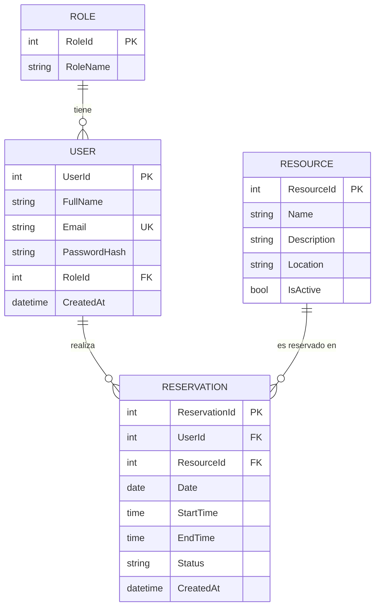

# SmartBook - Sistema de Reservas de Recursos

Sistema completo para gestión de reservas de recursos (canchas deportivas, salas de reuniones, equipos, etc.) con autenticación JWT, roles de usuario y panel de administración.


---

## Tabla de Contenidos

- [Características Principales](#características-principales)
- [Tecnologías Utilizadas](#tecnologías-utilizadas)
- [Diagrama ERD](#diagrama-erd)
- [Instrucciones de Instalación](#instrucciones-de-instalación)
- [Cómo Correr el Proyecto](#cómo-correr-el-proyecto)
- [Documentación de Endpoints](#documentación-de-endpoints)
- [Roles y Permisos](#roles-y-permisos)
- [Estructura del Proyecto](#estructura-del-proyecto)
- [Capturas de Pantalla](#capturas-de-pantalla)
- [Mejoras Futuras](#mejoras-futuras)
- [Autor](#autor)
- [Licencia](#licencia)

---

## Características Principales

- **Autenticación Segura**: Login y registro con JWT Bearer Tokens
- **Sistema de Roles**: Administrador y Cliente con permisos diferenciados
- **Gestión de Recursos**: CRUD completo para recursos reservables
- **Sistema de Reservas**: Creación, confirmación y cancelación con validación de disponibilidad
- **Validación de Horarios**: Prevención de conflictos de reservas (409 Conflict)
- **API RESTful**: Endpoints bien estructurados siguiendo mejores prácticas
- **Documentación Interactiva**: Swagger UI con autenticación JWT integrada
- **Contraseñas Seguras**: Hash con BCrypt
- **Manejo Global de Errores**: Middleware centralizado para excepciones

---

## Tecnologías Utilizadas

### Backend
| Tecnología | Versión | Descripción |
|------------|---------|-------------|
| ASP.NET Core | 8.0 | Framework web principal |
| Entity Framework Core | 8.0 | ORM para acceso a datos |
| JWT Bearer | - | Autenticación basada en tokens |
| BCrypt.Net | - | Hash seguro de contraseñas |
| Swashbuckle | - | Documentación Swagger/OpenAPI |

### Frontend
| Tecnología | Versión | Descripción |
|------------|---------|-------------|
| React | 18 | Librería UI |
| Vite | 5 | Build tool y dev server |
| Axios | - | Cliente HTTP |
| React Router | 6 | Navegación SPA |
| Bootstrap | 5 | Framework CSS |

### Base de Datos
| Tecnología | Descripción |
|------------|-------------|
| SQL Server | Base de datos relacional principal |
| EF Core Migrations | Control de versiones del esquema |

---

## Diagrama ERD



---

## Instrucciones de Instalación

### Requisitos Previos
- [.NET SDK 8.0](https://dotnet.microsoft.com/download/dotnet/8.0)
- [Node.js 18+](https://nodejs.org/)
- [SQL Server](https://www.microsoft.com/sql-server) (o SQL Server Express/LocalDB)

### 1. Clonar el Repositorio

```bash
git clone https://github.com/tu-usuario/SmartBook.git
cd SmartBook
```

### 2. Configurar el Backend

#### 2.1 Configurar `appsettings.json`

Navega a `SmartBookAPI/` y edita el archivo `appsettings.json`:

```json
{
  "ConnectionStrings": {
    "DefaultConnection": "Server=localhost;Database=SmartBookDB;Trusted_Connection=True;TrustServerCertificate=True;"
  },
  "JwtSettings": {
    "SecretKey": "TuClaveSecretaSuperSeguraDeAlMenos32Caracteres!",
    "Issuer": "SmartBookAPI",
    "Audience": "SmartBookApp",
    "ExpirationMinutes": 60
  },
  "Logging": {
    "LogLevel": {
      "Default": "Information",
      "Microsoft.AspNetCore": "Warning"
    }
  },
  "AllowedHosts": "*"
}
```

> **Importante**: En producción, usa variables de entorno o Azure Key Vault para el `SecretKey`.

#### 2.2 Ejecutar Migraciones

```bash
cd SmartBookAPI
dotnet restore
dotnet ef database update
```

Si no tienes EF CLI instalado:
```bash
dotnet tool install --global dotnet-ef
```

### 3. Configurar el Frontend

```bash
cd reservation-app
npm install
```

#### 3.1 Variables de Entorno (opcional)

Crea un archivo `.env` en `reservation-app/`:

```env
VITE_API_URL=https://localhost:7001/api
```

### Variables de Entorno Necesarias

| Variable | Descripción | Ejemplo |
|----------|-------------|---------|
| `ConnectionStrings__DefaultConnection` | Connection string de SQL Server | `Server=...` |
| `JwtSettings__SecretKey` | Clave secreta para firmar JWT (min 32 chars) | `MiClaveSecreta...` |
| `JwtSettings__Issuer` | Emisor del token | `SmartBookAPI` |
| `JwtSettings__Audience` | Audiencia del token | `SmartBookApp` |
| `VITE_API_URL` | URL base de la API (frontend) | `https://localhost:7001/api` |

---

## Cómo Correr el Proyecto

### Backend (API)

```bash
cd SmartBookAPI
dotnet run
```

La API estará disponible en:
- **HTTPS**: `https://localhost:7001`
- **HTTP**: `http://localhost:5000`
- **Swagger UI**: `https://localhost:7001/swagger`

### Frontend (React)

```bash
cd reservation-app
npm run dev
```

El frontend estará disponible en:
- `http://localhost:5173`

### Correr Ambos Simultáneamente

Terminal 1 (Backend):
```bash
cd SmartBookAPI && dotnet run
```

Terminal 2 (Frontend):
```bash
cd reservation-app && npm run dev
```

---

## Documentación de Endpoints

### Autenticación

| Método | Endpoint | Descripción | Auth | Body |
|--------|----------|-------------|------|------|
| `POST` | `/api/auth/register` | Registrar nuevo usuario | No | `{ "fullName": "Juan", "email": "juan@email.com", "password": "Pass123!" }` |
| `POST` | `/api/auth/login` | Iniciar sesión | No | `{ "email": "juan@email.com", "password": "Pass123!" }` |

### Recursos

| Método | Endpoint | Descripción | Auth | Body |
|--------|----------|-------------|------|------|
| `GET` | `/api/resources` | Listar todos los recursos | No | - |
| `GET` | `/api/resources/{id}` | Obtener recurso por ID | No | - |
| `POST` | `/api/resources` | Crear nuevo recurso | Admin | `{ "name": "Cancha 1", "description": "Fútbol 5", "location": "Piso 1" }` |
| `PUT` | `/api/resources/{id}` | Actualizar recurso | Admin | `{ "name": "Cancha 1 Actualizada", "description": "...", "location": "..." }` |
| `DELETE` | `/api/resources/{id}` | Eliminar recurso | Admin | - |

### Reservas

| Método | Endpoint | Descripción | Auth | Body |
|--------|----------|-------------|------|------|
| `GET` | `/api/reservations` | Listar reservas (Admin: todas, Client: propias) | Sí | - |
| `GET` | `/api/reservations/{id}` | Obtener reserva por ID | Sí | - |
| `POST` | `/api/reservations` | Crear nueva reserva | Sí | `{ "resourceId": 1, "date": "2024-12-20", "startTime": "10:00", "endTime": "11:00" }` |
| `PUT` | `/api/reservations/{id}` | Actualizar estado | Admin | `{ "status": "Confirmed" }` |
| `DELETE` | `/api/reservations/{id}` | Cancelar reserva | Sí* | - |

> *Client solo puede cancelar sus propias reservas

### Usuarios

| Método | Endpoint | Descripción | Auth | Body |
|--------|----------|-------------|------|------|
| `GET` | `/api/users` | Listar todos los usuarios | Admin | - |
| `DELETE` | `/api/users/{id}` | Eliminar usuario | Admin | - |

---

## Roles y Permisos

| Acción | Client | Admin |
|--------|:------:|:-----:|
| Registrarse | ✅ | ✅ |
| Iniciar sesión | ✅ | ✅ |
| Ver recursos | ✅ | ✅ |
| Crear recurso | ❌ | ✅ |
| Editar recurso | ❌ | ✅ |
| Eliminar recurso | ❌ | ✅ |
| Crear reserva | ✅ | ✅ |
| Ver sus reservas | ✅ | ✅ |
| Ver todas las reservas | ❌ | ✅ |
| Cancelar su reserva | ✅ | ✅ |
| Cancelar cualquier reserva | ❌ | ✅ |
| Confirmar reserva | ❌ | ✅ |
| Ver usuarios | ❌ | ✅ |
| Eliminar usuarios | ❌ | ✅ |

---

## Estructura del Proyecto

```
ReservationSystem/
├── SmartBookAPI/                    # Backend ASP.NET Core
│   ├── Controllers/                 # Controladores de API
│   │   ├── AuthController.cs
│   │   ├── ResourcesController.cs
│   │   ├── ReservationsController.cs
│   │   └── UsersController.cs
│   ├── Models/                      # Entidades de dominio
│   │   ├── User.cs
│   │   ├── Role.cs
│   │   ├── Resource.cs
│   │   └── Reservation.cs
│   ├── DTOs/                        # Data Transfer Objects
│   │   ├── Auth/
│   │   ├── Resource/
│   │   └── Reservation/
│   ├── Services/                    # Lógica de negocio
│   │   ├── Interfaces/
│   │   └── Implementations/
│   ├── Repositories/                # Acceso a datos
│   │   ├── Interfaces/
│   │   └── Implementations/
│   ├── Data/                        # DbContext y Seeders
│   │   ├── AppDbContext.cs
│   │   └── DbSeeder.cs
│   ├── Middleware/                  # Middleware personalizado
│   │   └── ErrorHandlingMiddleware.cs
│   ├── Program.cs                   # Configuración de la app
│   └── appsettings.json            # Configuración
│
├── reservation-app/                 # Frontend React + Vite
│   ├── src/
│   │   ├── components/             # Componentes reutilizables
│   │   ├── pages/                  # Vistas/páginas
│   │   ├── services/               # Llamadas a API (Axios)
│   │   ├── context/                # Context API (Auth)
│   │   ├── hooks/                  # Custom hooks
│   │   └── App.jsx
│   ├── package.json
│   └── vite.config.js
│
└── README.md                        # Este archivo
```

---

## Capturas de Pantalla

### Login
[Insertar captura]

### Dashboard de Cliente
[Insertar captura]

### Panel de Administración
[Insertar captura]

### Crear Reserva
[Insertar captura]

### Gestión de Recursos
[Insertar captura]

### Swagger UI
[Insertar captura]

---

## Mejoras Futuras

- [ ] **Notificaciones por Email**: Confirmación de reservas y recordatorios
- [ ] **Calendario Visual**: Vista de calendario para seleccionar fechas/horarios
- [ ] **Reservas Recurrentes**: Permitir reservas semanales/mensuales
- [ ] **Sistema de Pagos**: Integración con Stripe/PayPal
- [ ] **Reportes y Estadísticas**: Dashboard con métricas de uso
- [ ] **App Móvil**: React Native o Flutter
- [ ] **Refresh Tokens**: Implementar rotación de tokens
- [ ] **Rate Limiting**: Protección contra abuso de API
- [ ] **Auditoría**: Log de todas las acciones del sistema
- [ ] **Multi-idioma**: Internacionalización (i18n)
- [ ] **Tests Automatizados**: Unit tests y tests de integración
- [ ] **Docker**: Containerización para deployment

---

## Autor

**Tu Nombre**

- GitHub: [@tu-usuario](https://github.com/tu-usuario)
- LinkedIn: [Tu Perfil](https://linkedin.com/in/tu-perfil)
- Email: tu-email@ejemplo.com

---

## Licencia

Este proyecto está bajo la Licencia MIT. Ver el archivo [LICENSE](LICENSE) para más detalles.

```
MIT License

Copyright (c) 2024 Tu Nombre

Permission is hereby granted, free of charge, to any person obtaining a copy
of this software and associated documentation files (the "Software"), to deal
in the Software without restriction, including without limitation the rights
to use, copy, modify, merge, publish, distribute, sublicense, and/or sell
copies of the Software...
```

---

<p align="center">
  Hecho con .NET + React
</p>
